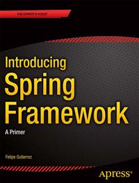

# Apress Source Code

This repository accompanies [*Introducing Spring Framework*](http://www.apress.com/9781430265320) by Felipe  Gutierrez (Apress, 2014).

Download the files as a zip using the green button, or clone the repository to your machine using Git.

## Releases

Release v1.0 corresponds to the code in the published book, without corrections or updates.

## Contributions

See the file Contributing.md for more information on how you can contribute to this repository.

## From the Author

The code is based on every chapter and contains some snippets on Java and Groovy.
